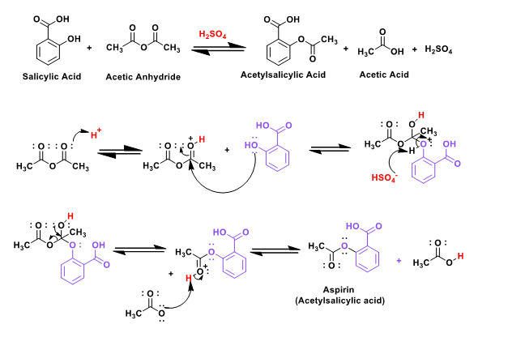
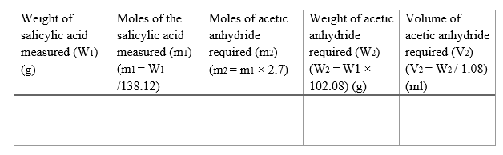
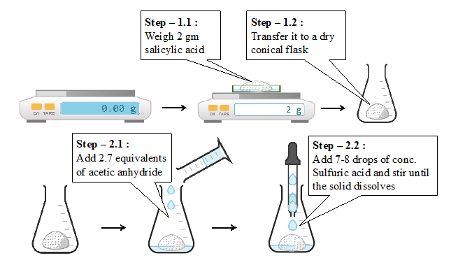
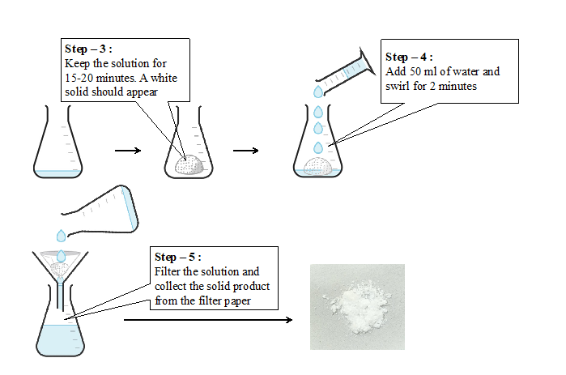
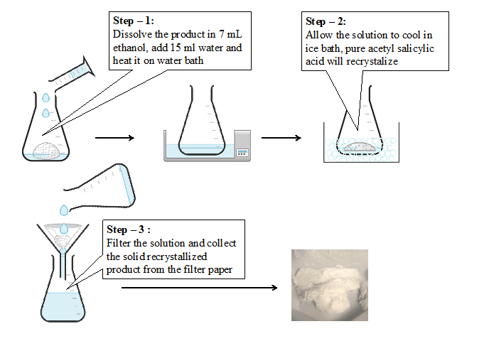
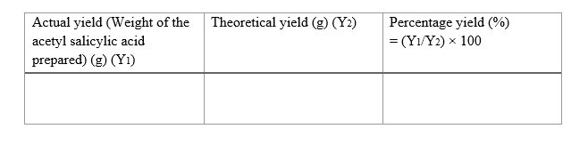
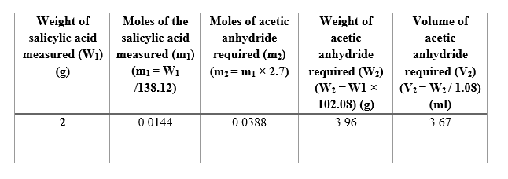
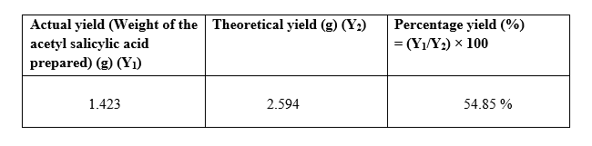

<b>Glassware required :</b> 
1)	Weighing balance 
2)	Conical flask (150 ml) 
3)	Measuring cylinder (10 ml, 100 ml) 
4)	Glass dropper    
5)	Filtering flask 
6)	Water bath 
7)	Ice bath  

<b>Chemicals required :</b> 
1)	Salicylic acid 
2)	Acetic Anhydride 
3)	Concentrated Sulfuric Acid 
4)	Ethanol 
5)	Distilled water.  

<b>Laboratory procedure :</b> 
1)	Weigh 2.0 g of salicylic acid (Mol. Wt. 138.12 g/mol) in a watch glass and transfer it to a dry 150 ml conical flask. 
2)	Add 2.7 equivalents of acetic anhydride (Mol. Wt. 102.08 g/mol) using a measuring cylinder to the salicylic acid. Add 7-8 drops of concentrated sulfuric acid and stir until all salicylic acid is dissolved. 
3)	Leave the reaction mixture undisturbed for 20 minutes. A white solid should appear.  
4)	Add 50 ml water to the flask and swirl for two minutes and filter. 
5)	Collect the solid from the filter paper.  

<b>Recrystallization :</b> 
1)	Dissolve the crude product in 7 ml ethanol in a beaker and add 15 ml of distilled water. Heat on water bath till you get a clear solution. 
2)	Allow the solution to cool in an ice bath without disturbing. Pure acetylsalicylic acid crystalizes. 
3)	Filter the pure product and allow it to dry.   

<b>Plausible mechanism :</b> 
  

<b>Laboratory procedure (diagram) :</b> 
Calculate the required amount of acetic anhydride- 
 
 
 

<b>Recrystallization</b> 
 

<b>Yield of the reaction :</b> 
 

<b>Calculation for the amount of acetic anhydride needed for a given amount of salicylic acid :</b> 

We have been asked to add 2.7 equivalents of acetic anhydride with respect to salicylic acid. 
Mol. Wt. of salicylic acid = 138.12 g/mol 
Mol. Wt. of acetic anhydride = 102.08 g/mol 
Density of acetic anhydride = 1.08 g/ml 
 

<b>Calculation of percentage yield of the prepared Aspirin :</b> 
Mol. Wt. of Aspirin = 180.158 g/mol 
From the chemical equation we know that 1 mole of salicylic acid will give 1 mol of acetyl salicylic acid / Aspirin. 

<b>Calculation of theoretical yield of acetyl salicylic acid: </b> 

Moles of salicylic acid taken = 0.0144 moles 
Hence, we should get 0.0144 moles of acetyl salicylic acid 
Theoretical yield = 0.0144 moles = 2.594 grams of acetyl salicylic acid.  

<b>Percentage yield : </b> 
 

