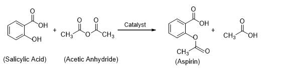

The discovery of aspirin was inspired by Felix Hoffman's attempt to find a drug to ease his father's arthritis without causing the severe stomach irritation associated with the standard anti-arthritis drug of the time, sodium salicylate. The name aspirin is believed to be derived from the "A" of acetyl and the "spir" of spiraea, the botanical name of the meadowsweet plant from which salicylic acid was first chemically isolated. Aspirin is one of the oldest and most useful drugs known. Salicylates are antipyretics; that is, they lower the body temperature of one who has a fever but has little effect if the temperature is normal. Salicylates are also mild analgesics, which relieve certain types of pain (such as headache, neuralgia, and rheumatism). The best-known form of aspirin is Alka Seltzer, which also contains citric acid and sodium bicarbonate. Aspirin is not very soluble in water; its solubility is only about 0.25 g/100 ml. The bicarbonate reacts with aspirin to form its sodium salt, thereby making it water-soluble and quicker in action. The bicarbonate reacts with citric acid to form carbon dioxide and the citric acid makes the taste of aspirin. 

Aspirin can simply be prepared in the laboratory by acetylation of salicylic acid. In this preparation, we will heat a mixture of salicylic acid and acetic anhydride with a little concentrated sulfuric as catalyst. The formed acetylsalicylic acid can be redissolved in ethanol and then recrystallized further from water. Acetylsalicylic acid crystallizes as needle-like crystals with a melting point of 135°C. It is odorless, but in moist air it gradually hydrolyzes into acetic and salicylic acids.  

 